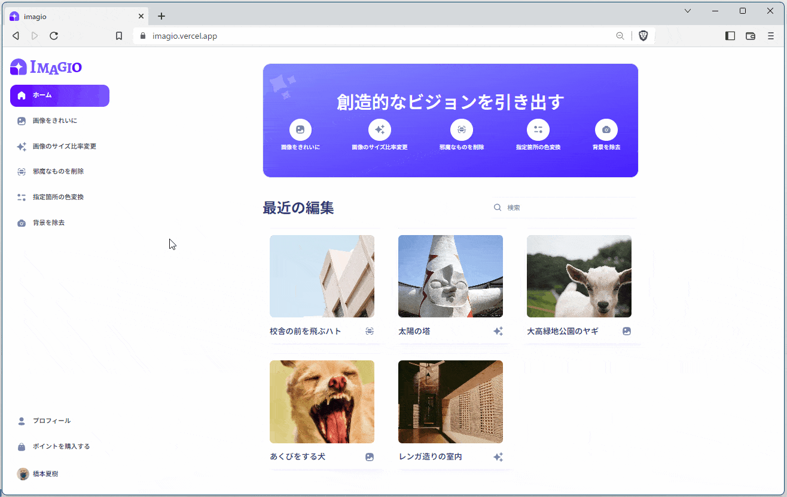

  

    
    
    
    
    
    
    
    
    
    
    
    
  

  <h3 align="center">AI SaaS Platform</h3>

  

    AI による Quick & Easy な画像加工を手軽に
  

## 📋 <a name="table">Table of Contents</a>

1. 🤖 [はじめに](#intro)
2. 🔗 [URL](#url)
3. 🔋 [アプリの機能](#feature)
4. 🚀 [アプリの利用サンプル](#example)
1. 🤸 [終わりに](#outro)

## <a name="intro">🤖 はじめに</a>

AI による Quick & Easy な画像加工を手軽に。オブジェクトの除去、背景の除去、色の塗り替えなど、5 種類の自動画像加工を体験できるアプリ、imagio のご紹介。

画像のアップロード、画像ライブラリから選択した画像を手軽に変換できます。

## <a name="url">🔗 URL</a>

imagio | AI SaaS Platform  
https://imagio.vercel.app/

## <a name="feature">🔋 アプリの機能</a>

### 👉 ユーザ認証システム

メールアドレス、または Google アカウントのログインによりユーザ認証を保護

### 👉 コミュニティ画像のショーケース

ユーザがこのアプリで変換した画像を一覧表示。ログインなしでもショーケースを見ることができます

### 👉 クイックレスポンスな画像検索

キーワードのタイピングに合わせてすばやく検索処理を実行

### 👉 画像変換機能（１）：画像をきれいに

古い画像や破損した画像を簡単に復元

### 👉 画像変換機能（２）：画像のサイズ比率変更

AI の予測画像生成を使って画像の寸法を拡張

### 👉 画像変換機能（３）：邪魔なものを削除

画像から指定したオブジェクトを識別し、抽出した物体を除去

### 👉 画像変換機能（４）：指定箇所の色変換

指定したオブジェクトを希望する色に塗り替え

### 👉 画像変換機能（５）：背景を除去

AI を使って画像の背景を削除

### 👉 変換画像のダウンロード

AI 変換された画像をローカルに保存可能

### 👉 変換画像の詳細ページ

画像一覧から各画像をクリックすると詳細ページに遷移

### 👉 画像の更新・削除

画像を保存をしたユーザは、詳細ページから画像の更新（再変換）、削除が可能

### 👉 クレジットシステム

安全な Stripe（決済システム）を使って、画像変換に必要なポイントの購入が可能

### 👉 プロフィールページ

変換された画像と残りポイントの情報を表示

### 👉 レスポンシブ UI/UX

ユーザーフレンドリーなインターフェイスでデバイスを選ばないシームレスなアプリ体験を提供

## <a name="example">🚀 アプリの利用サンプル</a>

1. [ログイン](#logged-in)
2. [メディアアップローダ](#uploader)
3. [画像変換機能（１）：画像をきれいに](#restore)
   1. [画像変換機能（１）：画像をきれいに](#restore)
   2. [画像変換機能（２）：画像のサイズ比率変更](#fill)
   3. [画像変換機能（３）：邪魔なものを削除](#remove)
   4. [画像変換機能（４）：指定箇所の色変換](#recolor)
   5. [画像変換機能（５）：背景の除去](#remove-background)
4. [ファイルダウンロード](#download)
5. [詳細ページ](#detail)
6. [画像の更新](#update)
7. [画像の削除](#delete)
8. [ポイント不足](#insufficient)
9. [ポイントの購入（Stripe を使った決済）](#stripe)
10. [ページネーション（次へ／前へ）](#pagination)
11. [ページ遷移（サイドバーから）](#transition-sidebar)
12. [ページ遷移（ヘッダから）](#transition-header)
13. [検索機能（デバウンス検索）](#search)
14. [表示デバイスに柔軟に対応するレイアウト設計](#responsive)
15. [ログインしていないユーザ](#not-logged-in)
16. [ログアウト](#logged-out)

### <a name="logged-in">ログイン</a>

### <a name="uploader">メディアアップローダ</a>

## <a name="restore">画像変換機能（１）：画像をきれいに</a>

画像の精細化。ぼやけた画像をくっきりきれいに修復

## <a name="fill">画像変換機能（２）：画像のサイズ比率変更</a>

AI の予測画像生成を使って画像の寸法を拡張

## <a name="remove">画像変換機能（３）：邪魔なものを削除</a>

画像から指定したオブジェクトを識別し、抽出した物体を除去

## <a name="recolor">画像変換機能（４）：指定箇所の色変換</a>

指定したオブジェクトを希望する色に塗り替え

## <a name="remove-background">画像変換機能（５）：背景の除去</a>

## <a name="download">ファイルダウンロード</a>

## <a name="detail">詳細ページ</a>

ログインユーザは、他のユーザが保存した画像を見られるが、更新や削除はできない。

## <a name="update">画像の更新</a>

## <a name="delete">画像の削除</a>

## <a name="insufficient">ポイント不足</a>

## <a name="stripe">ポイントの購入（Stripe を使った決済）</a>

## <a name="pagination">ページネーション（次へ／前へ）</a>

## <a name="transition-sidebar">ページ遷移（サイドバーから）</a>

## <a name="transition-header">ページ遷移（ヘッダから）</a>

## <a name="search">検索機能（デバウンス検索）</a>

検索フォームにキーワードを入力するとリアルタイムに、画像の検索結果が表示される。「検索」ボタンなどをクリックする必要がない。

デバウンスとは、わずかな一定間隔の間を置いて処理を実行する動きのこと。

## <a name="responsive">表示デバイスに柔軟に対応するレイアウト設計</a>

## <a name="not-logged-in">ログインしていないユーザ</a>

ユーザがログインしていない場合、他のユーザが作成した画像一覧は見られるが、画像詳細は見られず、画像変換機能も使えない。

画像詳細を見ようとしたり、画像変換機能を使おうとすると、ログイン画面に飛ぶ。

## <a name="logged-out">ログアウト</a>

## <a name="outro">🤸 おわりに</a>

より生活を便利に、スマートに、生活を支えるアプリを作っていきますので、よろしくお願いします！
